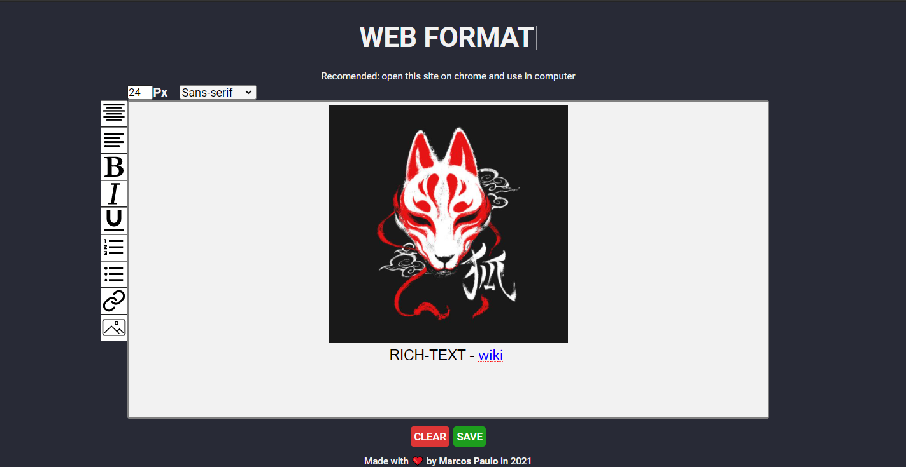

<h1 align="center">
    <a href="https://mr-soulfox.github.io/Web-Format/" style="color: white;">WEB FORMAT</a>
</h1>

## Description:

    A text editor with rich-text formatting.

 

## Status:
<h4 style="margin-left: 50px;"> 
	Completed ✔️
</h4>

 

## Features:

- [x] Rich-text formatting
- [x] Add link and images
- [x] Modify font
- [x] Save in .doc 
- [ ] App for desktop

 

## 🛠 Technologies:

- [SASS](https://sass-lang.com/)

 

## Lincense:
<a href="https://github.com/mr-soulfox/Web-Format/blob/main/LICENSE">MIT</a> © Marcos paulo

 

## Author

 
 

#### Marcos Paulo 🦊
### Made with 💙 by Marcos Paulo.
